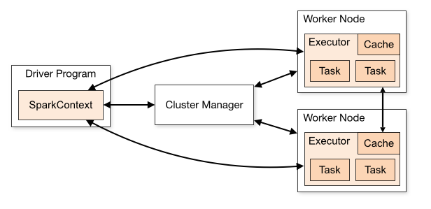

# 大数据Spark
&nbsp;&nbsp;Spark目前已经成为主流的大数据分析平台，所以熟练掌握spark的使用成为了机器学习/大数据分析领域必备的技能。

## Spark简介
目前所熟知的spark运用领域包含：
- 通用计算引擎，能够运行MapReduce、数据挖掘、图运算、流式计算、SQL等多种框架
- 基于内存，数据可存在内存中，特别适用于需要迭代多次运算的场景
- 与Hadoop继承，能够直接读写HDFS中的数据，并能运行再YARN之上



spark构成：
- Application		运行在集群上的用户程序，包含集群上的driver program和多个executor线程组成
- Driver program	application运行的main方法，并生成spark context
- Cluster Manager	集群资源管理器
- Deploy Model            部署模式，用于区别driver program的运行方式
++ cluster mode  集群模式，driver在集群内部启动
++ client mode    客户端模式（默认），driver进程从集群外部启动
- Worker node	      工作节点，运行application的节点
- Executor		       work node的上进程，运行task并保持数据交互，每一个application有自己的executor
- Task		运行于Executor中的任务单元，spark应用程序最终被划分为经过优化后的多个任务的集合
- Job		由多个转变构建的并行计算任务，具体为spark中的action操作，一个action就为一个job			

目前市场主流的spark编程语言：
- scala，官方推荐
- python，可以使用pyspark，对于会python的人来说上手很快

## Azkaban使用
[【以下部分内容引】](https://www.cnblogs.com/honeybee/p/7921626.html)

azkaban是一款可以通过UI调用spark进行大数据分析的开源软件平台

主页：[https://azkaban.github.io/](https://azkaban.github.io/)

github：[https://github.com/azkaban/azkaban](https://github.com/azkaban/azkaban)

azkaban的工作流中的参数可以分为如下几个类型：

|参数类型|作用域说明|
|---------:|:-----------------------|
|UI 页面输入参数 ，即工作流参数|flow全局有效|
|工作流ZIP压缩包中的属性文件|flow全局有效，zip文件目录以及子目录有效|
|工作流运行时参数|flow全局有效|
|环境变量参数|flow全局有效|
|job的common参数|job内局部有效|
|job文件中定义的参数|job内局部有效|
|上游作业传递给下游的参数|job局部有效|

## RDD介绍
以下引：[https://www.jianshu.com/p/248f3946ee31](https://www.jianshu.com/p/248f3946ee31)

​	RDD就像一个Numpy array或者一个Pandas series，可以视作一个有序的item集合

​	只不过，这些item并不存在driver端的内存里，而是被分割成很多个partitions，每个partition的数据存在集群的executor的内存中

​	在Spark里，所有的处理和计算任务都会被组织成一系列Resilient Distributed Dataset(弹性分布式数据集，简称RDD)上的transformations(转换) 和 actions(动作)。 

+ Transformations
1. map() 对RDD的每一个item都执行同一个操作
2. flatMap() 对RDD中的item执行同一个操作以后得到一个list，然后以平铺的方式把这些list里所有的结果组成新的list
3. filter() 筛选出来满足条件的item
4. distinct() 对RDD中的item去重
5. sample() 从RDD中的item中采样一部分出来，有放回或者无放回
6. sortBy() 对RDD中的item进行排序
- Action
1. collect() 计算所有的items并返回所有的结果到driver端，接着collect()会以python list的形式返回结果
2. first() 和上面是类似的，不过只返回第1个item
3. take(n) 类似，但是返回n个item
4. count() 计算RDD中item的个数
5. top(n) 返回头n个items，按照自然结果排序
6. reduce() 对RDD中的items做聚合
- 更为复杂的transformations和actions
1. reduceByKey() 对所有有着相同key的items执行reduce操作
2. groupByKey() 返回类似（key，listOfValues）元组的RDD，后面的value List是同一个key下面的
3. sortByKey() 按照key排序
4. countByKey() 按照key取对item个数进行统计
5. collectAsMap() 和collect有些类似，但是返回的是k-v的字典

## 文件读取
```python
textFile = sc.textFile("file:///usr/local/spark/mycode/wordcount/word.txt")
```
textFile是一个方法，用来加载文本数据，默认是从HDFS上加载，如果要加载本地文件，就必须使用file:///加路径的形式

遇到的坑：
RDD对象action不能嵌套调用，比如rdd_1.map(...., func_1(rdd_2))，会异常出错