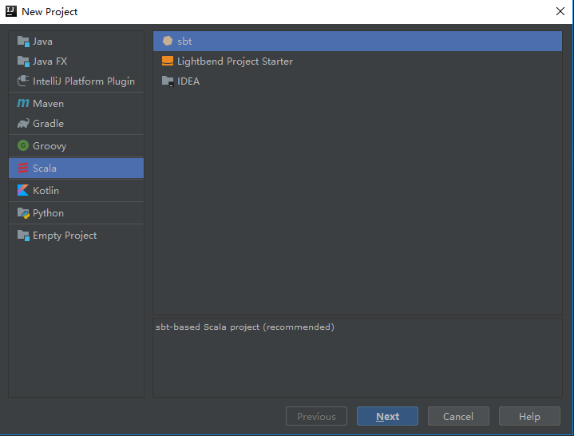

# Scala开发须知

​	scala一般用于开发高并发高可用的网络后台程序，也可以用于开发spark程序。以下先介绍如何创建一个scala后台（命令行）程序需要的步骤。

## 开发环境搭建

- IDE：intelliJ IDEA community（社区版本）
- scala安装包
- sbt安装包
- jdk使用1.8就ok

以上包自行安装需要的版本


创建sbt工程：File-->New -->Project



新建工程后会，生成的目录结构如下：

|--.idea（工程文件）

|--project（项目文件夹）

|--src（源代码目录）

​	|--main

​		|--scala（源码包放置在该目录下）

​	|--test（单元测试目录）

​		|--scala

|--build.sbt（工程构建文件）

当工程目录架构被创建之后，idea会根据build.sbt文件下载一系列需要的Libraries和Plugins，不够的需要自己添加。当然，也可以在sbt文件中定义一些其他的操作，以下是参数详解：

|              参数名 | 含义                             |
| ------------------: | -------------------------------- |
|                name | 项目名称                         |
|        organization | 组织名称                         |
|             version | 版本号                           |
|        scalaVersion | 使用的scala版本号                |
| libraryDependencies | 添加源码编译运行期间使用的依赖包 |
|                     |                                  |

除此之外，还需要在project目录下面新建一个文件：plugins.sbt，添加以下内容：

```sbt
addSbtPlugin("com.eed3si9n" % "sbt-assembly" % "0.14.7")
```

以上内容的作用是安装assembly打包模块。通常我们使用packge命令进行打包，但是引用第三方包的情况下，不会主动打包第三方包，造成编译通过，但是无法正确运行。提示：class 丢失

## 创建hello world

关于scala语法以及特性，请参考：[Scala开发教程]( https://www.w3cschool.cn/scaladevelopmentguide/zecg1jb8.html )

src/main/scala/test/Main.scala

```scala
package test

object Main {
  def main(args: Array[String]): Unit = {
  	println("hello world!")    
  }
}
```

- 初始化sbt环境

```shell
>sbt
[info] Loading global plugins from ***
[info] Loading settings for project ***-build from plugins.sbt ...
[info] Loading project definition from ****
[info] Loading settings for project test from build.sbt ...
[info] Set current project to test (in build file:***)
[info] sbt server started at local:sbt-server-72b704482cc3cfe0971e
```

- 清除

```shell
>clean
清除tarhget下生成的文件
```

- 更新

```shell
>update
根据构建配置更新依赖项
```

- test

```shell
>test
运行test目录下的所有测试用例
```

- reload

```shell
>reload
重新载入构建配置文件
```

- compile

```shell
>compile
编译项目，生成class文件
```

- package

```shell
>package
将src/main中的所有类打包为jar
```

- assembly（安装sbt-assembly插件才有）

```shell
>assembly
根据项目配置的libraryDependencies进行打包
```

## 命令行模式

在shell环境（windows cmd）直接运行scala进入命令行模式

```shell
$scala
切换shell环境
scala>
```

## 语法解析

- scala深拷贝

复写（overwrite）clone函数

- 无参方法

调用无参方法比如current时，你可以写上()，也可以不写：

```scala
myCounter.current	//ok
myCounter.current()	//ok
```

应该使用哪一种形式呢？我们认为对于“改值器方法”，即改变对象状态的方法使用()，而对于取值器方法不会改变对象状态的方法去掉()是不错的风格。
当然，你可以通过以不带()的方式声明current来强制这种风格：

```scala
class Counter {
	def current = value		//定义中不带()
}
```

这样一来类的使用者旧必须用myCounter.current，不带圆括号来调用该方法。

- “方法”和“函数”

定义一个方法：

```scala
def m(x: Int) = 2*3
```

定义一个函数：

```scala
val f = (x: Int) => 2*3
```

方法不能作为最终表达式出现：

```shell
scala> m
<console>:13: error: missing argument list for method m
Unapplied methods are only converted to functions when a function type is expected.
You can make this conversion explicit by writing `m _` or `m(_)` instead of `m`.
       m
       ^
```

函数可以作为最终表达式出现：

```shell
scala> val f = (x: Int) => 2*3
f: Int => Int = $$Lambda$1046/2062667890@3ace6346
```

而无参方法可以作为最终表达式出现，其实这属于方法“调用”，scala规定无参函数的调用可以省略括号

```shell
scala> def m1() = 1+2
m1: ()Int

scala> m1
res1: Int = 3
```

**参数列表对于方法是可选的，但是对于函数是强制的**

方法可以没有参数列表（或空）：

```shell
scala> def m2 = 100
m2: Int
scala> def m3() = 100
m3: ()Int
```

而，函数必须有参数列表，否则报错：

```shell
scala> var f1 = => 100
<console>:1: error: illegal start of simple expression
       var f1 = => 100
                ^
```

函数可以有一个空的参数列表：

```shell
scala> var f2 = () => 100
f2: () => Int = $$Lambda$1057/1141137903@5977bdea
```

**方法名意味着方法调用，函数名只是代表函数自身**

因为方法不能作为最终的表达式存在，所以如果你写了一个方法的名字并且该方法不带参数（没有参数列表或者无参）

该表达式的意思是：调用该方法得到最终的表达式（结果）

函数可以作为最终表达式出现，如果你写下函数的名字，函数调用并不会发生，该函数自身将作为最终的表达式进行返回，如果要强制调用一个函数，你**必须**在函数后面写()

```shell
scala> //该方法没有参数列表

scala> m2
res11: Int = 100

scala> //该方法有一个空的参数列表

scala> m3
res12: Int = 100

scala> //得到函数自身，不会发生函数调用

scala> f2
res13: () => Int = <function0>

scala> //调用函数

scala> f2()
res14: Int = 100
```

**为什么在函数出现的地方我们可以提供一个方法**

```shell
scala> val myList = List(3,56,1,4,72)
myList: List[Int] = List(3, 56, 1, 4, 72)

scala> // map()参数是一个函数

scala> myList.map((x) => 2*x)
res15: List[Int] = List(6, 112, 2, 8, 144)

scala> //尝试给map()函提供一个方法作为参数

scala> def m4(x:Int) = 3*x
m4: (x: Int)Int

scala> //正常执行

scala> myList.map(m4)
res17: List[Int] = List(9, 168, 3, 12, 216)
```

这是因为，如果期望出现函数的地方我们提供了一个方法的话，该方法就会自动被转换成函数。该行为被称为ETA expansion。

这样的话使用函数将会变得简单很多。你可以按照下面的代码验证该行为：

```shell
scala> //期望出现函数的地方，我们可以使用方法

scala>  val f3:(Int)=>Int = m4
f3: Int => Int = <function1>

scala> //不期望出现函数的地方，方法并不会自动转换成函数

scala> val v3 = m4
<console>:8: error: missing arguments for method m4;
follow this method with `_‘ if you want to treat it as a partially applied function
       val v3 = m4
                ^
```

 利用这种自动转换，我们可以写出很简洁的代码，如下面这样 

```shell
scala> //10.<被解释成obj.method，即整形的<的方法，所以该表达式是一个方法，会被解释成函数

scala> myList.filter(10.<)
res18: List[Int] = List(56, 72)
```

因为在scala中操作符被解释称方法

- 前缀操作符：op obj 被解释称obj.op
- 中缀操作符：obj1 op obj2被解释称obj1.op(obj2)
- 后缀操作符：obj op被解释称obj.op

你可以写成10<而不是10.<

```shell
scala> myList.filter(10<)
warning: there were 1 feature warning(s); re-run with -feature for details
res19: List[Int] = List(56, 72)
```

**如何强制把一个方法变成函数**

 可以在方法名后面加一个下划线强制变成函数，部分应用函数 

```shell
scala> val f4 = m4 _
f4: Int => Int = <function1>

scala> f4(2)
res20: Int = 6
```

**传名参数是一个方法**

 传名参数实质是一个没有参数列表的方法。正是因此你才可以使用名字调用而不用添加() 

```shell
scala> //使用两次‘x‘，意味着进行了两次方法调用

scala> def m1(x: => Int)=List(x,x)
m1: (x: => Int)List[Int]

scala> import util.Random
import util.Random

scala> val r = new Random()
r: scala.util.Random = scala.util.Random@d4c330b

scala> //因为方法被调用了两次，所以两个值不相等

scala> m1(r.nextInt)
res21: List[Int] = List(-1273601135, 2004676878)
```

 如果你在方法体部分缓存了传名参数（函数），那么你就缓存了值（因为x函数被调用了一次） 

```shell
scala> //把传名参数代表的函数缓存起来

scala> def m1(x: => Int) ={val y=x;List(y,y)}
m1: (x: => Int)List[Int]

scala> m1(r.nextInt)
res22: List[Int] = List(-1040711922, -1040711922)
```

 能否在函数体部分引用传名参数所代表的方法呢，是可以的(缓存的是传名参数所代表的方法)。 

```shell
scala> def m1(x: => Int)={val y=x _;List(y(),y())}
m1: (x: => Int)List[Int]

scala> m1(r.nextInt)
res23: List[Int] = List(-1982925840, -933815401)
```

